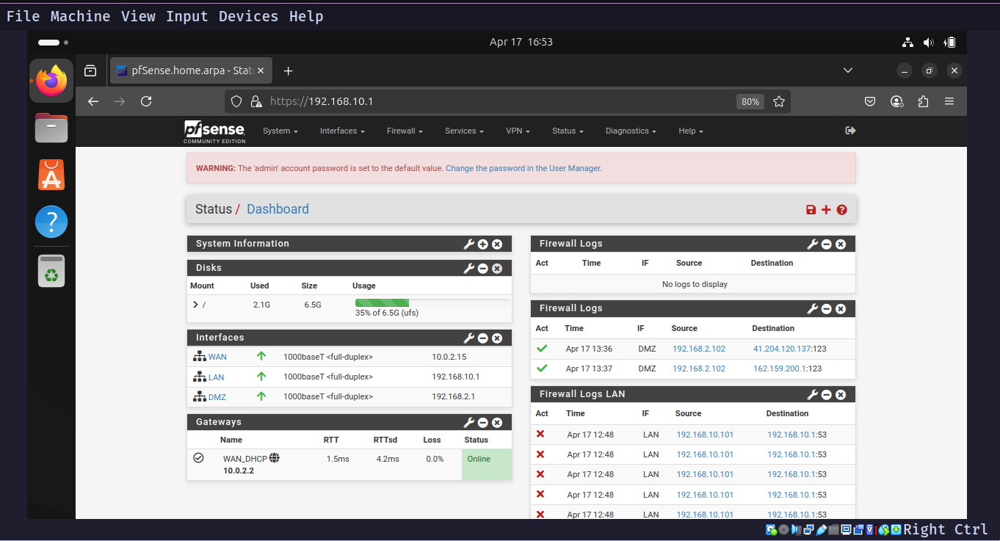

# Home Network Security Lab

A hands-on project simulating a secure home network built in VirtualBox on Arch Linux with Hyprland. Features a pfSense firewall managing WAN, LAN (`192.168.10.0/24`), and DMZ (`192.168.2.0/24`) networks, with an Ubuntu LAN client and an Alpine Linux DMZ web server running Nginx. Designed to practice firewall configuration, traffic monitoring, and network administration skills for a system and network administrator internship.

---

## Table of Contents

- [Project Overview](#project-overview)
- [Network Setup](#network-setup)
- [Challenges and Solutions](#challenges-and-solutions)
- [Future Improvements](#future-improvements)
- [Tools Used](#tools-used)
- [Exported Files](#exported-files)

---

## Project Overview

This lab demonstrates core network security concepts through a virtualized environment:

- **pfSense Firewall**: Manages WAN, LAN, and DMZ with custom firewall rules and NAT.
- **LAN Client**: Ubuntu VM (`192.168.10.100`) for testing connectivity and web UI access.
- **DMZ Web Server**: Lightweight Alpine Linux VM (`192.168.2.101`) running Nginx.
- **Traffic Monitoring**: Logs and packet captures to analyze network activity.

**Objective**: Build practical skills in network segmentation, firewall management, and troubleshooting for real-world administration roles.

---

## Network Setup

### 1. pfSense VM Configuration

- **Download**: `netgate-installer-amd64.iso.gz` from [pfsense.org](https://www.pfsense.org).
- **Decompression**: `gunzip netgate-installer-amd64.iso.gz`.
- **VM Specs**: 512MB RAM, 8GB disk, NAT (WAN), Internal LAN network.
  - Initial LAN: `192.168.1.1/24`, changed to `192.168.10.1/24` to avoid Starlink conflict.
- **Installation**: Set LAN DHCP range to `192.168.10.100–200`.
- **KVM Fix**: Unloaded `kvm_intel` to resolve VirtualBox conflict.
- **Web UI**: Accessible at `https://192.168.10.1` (admin/pfsense).

### 2. LAN Client Setup

- **VM**: `LAN-Client` (Ubuntu, 2GB RAM, 10GB disk).
- **Network**: Internal Network `LAN`, IP `192.168.10.100/24` via DHCP.
- **Validation**: Confirmed connectivity (`ping 192.168.10.1`) and web UI access.

### 3. DMZ Web Server Setup

- **VM**: `DMZ-Web-Alpine` (Alpine Linux, 512MB RAM, 2GB disk).
- **Network**: Internal Network `DMZ`, IP `192.168.2.101/24` via DHCP.
- **Web Server**: Installed Nginx, document root at `/var/www/localhost/htdocs`.
- **Test Page**: Created `index.html` with `<h1>Welcome to DMZ Web Server</h1>`.
- **Timezone**: Set to `Africa/Antananarivo` (Madagascar, UTC+3) using `tzdata`.
- **Access Test**: Verified from LAN client with `curl http://192.168.2.101`.

### 4. Firewall Configuration

#### LAN Rules

- Allow LAN to DMZ web server (`192.168.2.101:80`).
- Allow LAN to internet.
- Block LAN to RFC1918 networks (via `RFC1918_Networks` alias, excluding lab subnets).

#### DMZ Rules

- Allow DMZ to internet.
- Block DMZ to LAN.
- Block DMZ to RFC1918 networks.

#### Fixes

- Reordered rules to prioritize LAN-to-DMZ access.
- Adjusted `RFC1918_Networks` alias to exclude lab subnets (`192.168.2.0/24`, `192.168.10.0/24`).

### 5. Traffic Monitoring

- **Logging**: Enabled on firewall rules for passed and blocked traffic.
- **Logs**: Monitored via Status > System Logs > Firewall.
- **Packet Capture**: Analyzed LAN traffic using Diagnostics > Packet Capture.

---

## Network Topology

The diagram below illustrates the network structure:

---

## Challenges and Solutions

- **Starlink IP Conflict**: Changed pfSense LAN to `192.168.10.1/24` to avoid overlap with Starlink router (`192.168.1.1`).
- **VirtualBox KVM Error**: Unloaded `kvm_intel` to enable pfSense VM operation.
- **DMZ Connectivity**: Configured NAT and firewall rules to enable internet access.
- **Nginx 404 Error**: Set correct document root (`/var/www/localhost/htdocs`) on Alpine.
- **RFC1918 Blocking Issue**: Reordered rules and refined alias to allow LAN-to-DMZ traffic.

---

## Future Improvements

- Integrate IDS/IPS (e.g., Suricata) for threat detection.
- Simulate attacks (e.g., brute force) to test firewall resilience.
- Implement VLANs, building on Packet Tracer experience.

---

## Tools Used

- **OS**: Arch Linux with Hyprland
- **Virtualization**: VirtualBox
- **Firewall**: pfSense 2.7.2
- **Client**: Ubuntu
- **Web Server**: Alpine Linux with Nginx
- **Version Control**: Git/GitHub

---

## Exported Files

- **Firewall Rules**: [firewall_rules.xml](firewall_rules.xml)
- **Log Sample**: [system.log](system.log)

---

*Last updated: April 17, 2025*